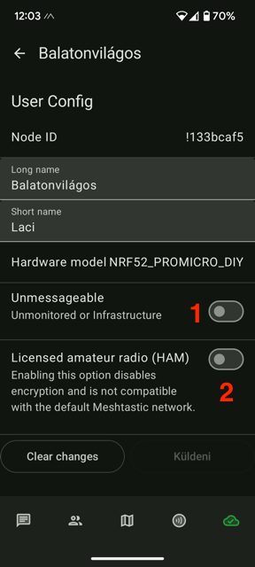

# MeshTips
Meshtastic indulási segédlet - végigvezetlek az Android app alapvető beállításain. Ez elegendő lesz az eszközöd beüzemeléséhez és a vételkörzetedben elérhető állomások felderítéséhez.

További segítséget kaphatsz a hazai közösségben:

[FB csoport](https://www.facebook.com/groups/1756983494805627/)

[TELEGRAM csatorna](https://web.telegram.org/k/#@meshtastic1)  - forgalmasabb, általában rövid időn belül válaszol valaki

## Eszköz beállítások

 User Config: A "Long name" és a "Short name" mezők fognak elküldésre kerülni a nodeinfo adásakor, ellenállomásaid ezeket a neveket fogják látni, amiket itt megadtál.
