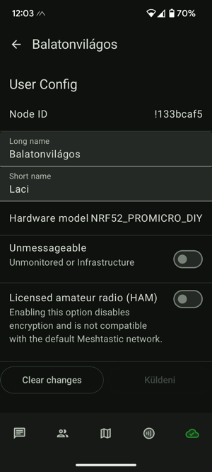

# MeshTips
Meshtastic indulási segédlet - végigvezetlek az Android app alapvető beállításain. Ez elegendő lesz az eszközöd beüzemeléséhez és a vételkörzetedben elérhető állomások felderítéséhez. Csupán kövesd a képernyőfotókat és állíts be mindent ugyanígy. Ha nem szeretnéd a pozíciódat másokkal megosztani, a "Positions" beállításait hagyd kikapcsolva.

További segítséget kaphatsz a hazai közösségben:

[FB csoport](https://www.facebook.com/groups/1756983494805627/)

[TELEGRAM csatorna](https://web.telegram.org/k/#@meshtastic1)  - forgalmasabb, általában rövid időn belül válaszol valaki

## Eszköz beállítások

<strong> User Config: </strong>  
A "Long name" és a "Short name" mezők fognak elküldésre kerülni a nodeinfo adásakor, ellenállomásaid ezeket a neveket fogják látni, amiket itt megadtál.  
<strong> Unmessageable: </strong> Ha ezt bekapcsolod, azzal jelezheted, hogy az eszközödhöz nem kapcsolódsz applikációval, állomásod nem fogad üzeneteket. Például, ha csak "átjátszóként" használod az eszközt, de közvetlenül nem szoktál hozzá kapcsolódni és nem látnád az ide küldött privát üzeneteket.  
<strong> Licensed Amateur Radio: </strong> Ezt a kapcsolót csak akkor használd, ha rádióamatőrként az eszközöd akár teljes teljesítményévével kívánsz sugározni, valamint nem kívánsz titkosítási kulcsokat használni. Ezt hagyd alapértelmezetten kikapcsolva.

